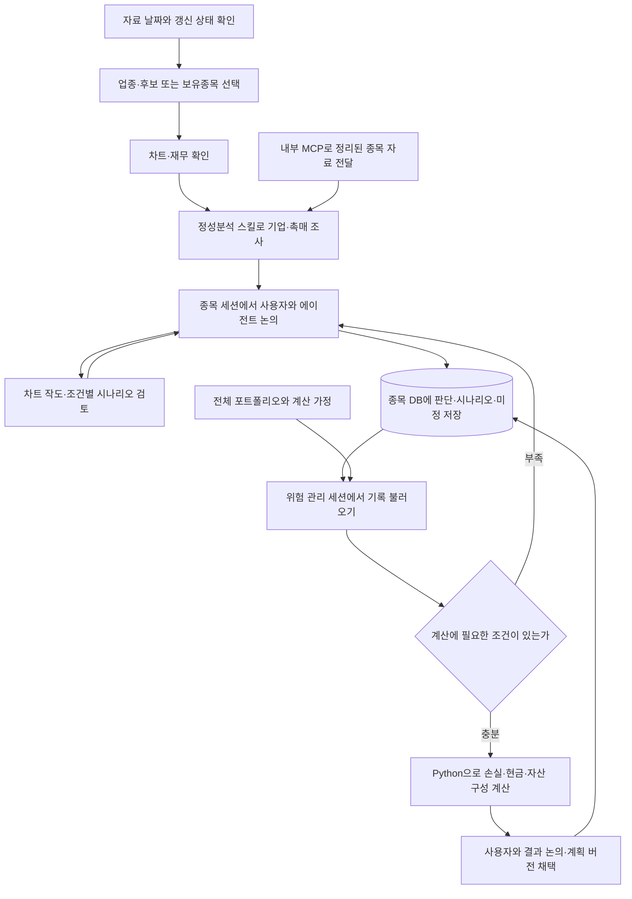

# 투자에이전트 | Investment Agent Engine

**LLM이 만들어 내는 텍스트를 어떻게 투자 판단에 쓸 수 있는 의미 있는 정보로 만들까?**

이 프로젝트를 만들면서 가장 많이 고민한 질문입니다. LLM은 그럴듯한 설명을 만들어 낼 수 있지만, 그 설명이 내가 보고 있는 종목의 실제 자료와 내 판단 조건에 맞는지는 따로 확인해야 합니다. 어떤 데이터를 넣고, 어떤 맥락을 이어 주며, 답변을 무엇과 대조할 수 있게 할지가 중요하다고 생각했습니다.

그 고민에서 나온 것이 **사용자와 에이전트가 함께 일하는 공간, Invest Agent Workbench**입니다. 저는 작업대에서 종목을 고르고 자료와 차트를 보며 생각을 구체화합니다. 에이전트는 같은 자료를 읽고 저와 논의하며, 확인한 사실과 제 판단, 아직 모르는 것을 정리합니다. 대화에서 정리한 내용은 다음 작업에서도 꺼내 쓸 수 있도록 종목별 기록으로 남깁니다.

이 연결을 위해 내부 MCP를 만들었습니다. MCP는 에이전트가 작업대의 자료를 읽고 결과를 저장하는 통로입니다. 종목 자료를 정리해 공급하고, 어떤 자료와 시점을 기준으로 답했는지 확인할 수 있도록 했습니다. 차트에 그은 선도 좌표와 수식으로 표현해 에이전트가 읽고 시나리오 논의에 활용하도록 연결하는 것이 구상입니다. 정제된 데이터와 사용자의 판단 맥락을 함께 입력해, 근거를 확인하고 계산으로 이어갈 수 있는 답변을 얻으려는 것입니다.

지금은 종목 스크리닝과 분석을 중심으로 이 작업대를 만들고 있으며, 여기에 전체 계좌의 위험 관리를 연결하고 있습니다. 좋은 입력이 답변의 정확성을 보장하지는 않으므로, 근거 확인과 수치 계산, 최종 판단의 역할도 나누었습니다.

이 저장소에는 그중 **재사용할 수 있는 Python 엔진과 내부 MCP 연결 코드, 합성 데이터 예제, 사용 안내**를 공개합니다. 개인적으로 사용하는 작업대 화면과 실제 계좌·판단 기록은 포함하지 않습니다. 자동 주문 기능도 없습니다.

## 함께 일하는 방식

제가 생각한 흐름은 스크리닝에서 종목을 고르고 `정성 분석하기`로 기업의 주요 촉매와 확인할 사항을 파악하는 것에서 시작합니다. 분석을 진행한 세션에서는 그 결과를 놓고 에이전트와 논의합니다. 필요하면 작업대로 돌아가 차트에 선을 긋고, 그 조건에서 어떤 매수·매도 시나리오를 생각할 수 있을지 다시 이야기합니다.

논의가 정리되면 에이전트가 판단 근거와 대응 조건, 미정을 종목 데이터베이스에 저장합니다. 위험 관리 세션에서는 그 기록을 불러와 전체 포트폴리오와 함께 봅니다. 여러 종목의 시나리오가 함께 일어나면 손실과 현금, 자산 구성이 어떻게 달라지는지 Python으로 계산하고, 그 결과를 놓고 다시 논의하는 방식입니다. 종목별 대화에서 쌓은 맥락을 계좌 전체의 판단으로 이어가는 것이 목표입니다.

여기서 **정성분석 스킬은 기업을 조사하고 분석하는 역할**을 맡습니다. 그 이후 사용자와 논의를 이어가고, 위험 관리에 필요한 내용을 확인하고 기록하는 행동은 `AGENTS.md`의 협업 규칙으로 분리했습니다. 당시 정리한 일곱 가지 논의 항목도 사용자가 양식처럼 한꺼번에 채우는 질문지가 아니라, 에이전트가 대화하면서 확인하고 정리할 내용입니다.

이것이 전체 작업 방향이며, 아래는 그 방향으로 연결하면서 실제로 고친 부분과 아직 확인할 부분입니다.

## 지난 게시 이후 무엇을 고민했나

10월 1일 v2.2.0까지는 업종과 종목 후보를 추리고 차트와 계좌를 확인하는 기반을 만들었습니다. 10월 5일 v2.3.0까지 이어진 작업에서는 이 기능들을 실제로 사용하는 과정에 집중했습니다.

이 구상을 실제 사용 흐름으로 옮기려면 자료가 에이전트에게 제대로 전달되고, 대화의 결론이 다음 계산의 입력으로 남아야 했습니다. 수집 결과, 차트, 기업 보고서가 각각 있어도 보유 목적과 대응 조건을 다시 정리하고 계좌 영향을 연결해야 했습니다. 이번에는 이 사이의 빈 부분을 채우는 데 시간을 썼습니다.

### 정상 데이터까지 없애고 있지는 않은가

수집 과정에서 종목 유형이나 시가총액, 분류 정보 때문에 정상적으로 받은 가격 자료까지 제외되는 문제가 있었습니다. 일부 정보가 부족하다는 이유로 종목 자체를 빼면 무엇이 누락됐는지 확인하기도 어려워집니다.

그래서 **자료를 확보하는 단계와 투자 후보를 고르는 단계를 분리**했습니다. 정상적으로 받은 시세는 보존하고, 실제로 빠진 종목이나 필드만 보완하도록 수정했습니다. 시가총액 부족, 분류 미확인, 통신 실패도 서로 다른 상태로 남겼습니다. 관심 대상에서 제외할 종목을 직접 정하는 것은 그다음의 별도 판단입니다.

### 숫자를 많이 보여주는 것보다 읽고 비교할 수 있어야 했다

재무 화면은 익숙한 Finviz 형식을 참고하되, 이번 범위에서 확보하지 못하는 예상치보다 매출·영업이익·순이익·EPS의 실제 실적과 성장률에 집중했습니다. 연간과 분기를 바꿔 보고, 숫자의 공시 근거와 계산 기준도 확인할 수 있게 했습니다.

연결하는 과정에서는 은행의 수익을 일반기업 매출처럼 처리하거나, 서로 다른 기간과 EPS 기준을 섞어 비교할 수 있다는 문제가 드러났습니다. 값을 채우는 것만으로는 충분하지 않았습니다. 같은 기준으로 비교할 수 있는지 확인하고, 없는 값과 비교할 수 없는 값은 이유를 남기기로 했습니다.

차트도 사용하는 순서에 맞춰 고쳤습니다. 일·주·월봉에서 작도를 이어 보고, 채널은 하단 두 점을 먼저 잡도록 바꿨습니다. 주봉이나 월봉의 고가·저가에 붙인 점이 실제 발생일과 어긋나는 문제도 수정했습니다. 선이 저장되는 것과 의도한 위치에 남는 것은 별개의 확인 사항이었습니다.

### AI 보고서를 읽는 데서 끝나지 않게 하려면

기업 분석에서는 과거 주가 변곡점과 당시 사건·촉매를 연결하고, 중요한 구간을 조사에서 빠뜨리지 않도록 보완했습니다. 조사하지 않은 구간과 조사했지만 원인을 찾지 못한 구간을 구분하고, 배당·자사주 매입도 발표와 실제 실행을 나누어 확인하도록 했습니다.

분석 버튼에서 같은 입력 자료로 조사를 시작하고, 결과를 해당 분석건에 저장한 뒤 후속 대화를 이어가는 연결도 만들었습니다. 이후 대화에서는 보고서 내용과 함께 내가 왜 관심을 갖는지, 어떤 사실이 나오면 판단을 바꿀지, 아직 무엇을 모르는지를 남기도록 했습니다.

### 대화로 답했는데 왜 다시 입력해야 하는가

연결 과정에서 가장 직접적인 문제가 드러났습니다. 종목에 관해 이미 대화하고 계획을 저장했는데도 계산용 시나리오가 비어 있어 계좌 영향 계산을 선택할 수 없었습니다. 대화 기록을 남기는 기능과 계산을 준비하는 기능 사이가 끊겨 있었습니다.

확인된 조건을 계산용 시나리오로 정리하는 일은 에이전트가 맡도록 규칙과 진입점을 보완했습니다. 사용자가 평가일·가격·환율·비용을 한꺼번에 다시 작성하는 대신, 계산을 막는 중요한 미정부터 하나씩 확인하게 했습니다. 아직 정하지 않은 값은 빈 상태로 남깁니다. 대응 조건의 가격을 미래 평가 가격이나 실제 체결 가격으로 바꾸어 가정하지 않습니다.

계획은 버전별로 남기고, 내가 검토해 채택한 버전과 새 초안을 구분했습니다. **보고서 저장 → 계획 초안 → 가정 계산 → 사용자 채택**은 각각 별도 단계이며, 어느 단계도 실제 주문을 뜻하지 않습니다.

## 작업대에서는 이렇게 사용합니다

아래는 비공개 작업대를 포함해 연결하고 있는 전체 협업 흐름입니다. 공개 저장소에서는 이 중 엔진 계산과 합성 예제를 실행할 수 있습니다. 실제 계좌까지의 연결에는 아래에 적은 입력 확인이 남아 있습니다.



계좌 화면은 보유자산·현금·계획·위험을 한 맥락에서 보도록 정리했습니다. 사용자는 자연스럽게 판단과 조건을 설명하고, 정리된 계획과 계산 가정이 자신의 의도에 맞는지 확인합니다. [버튼별 사용 안내](https://github.com/0gnm0-afk/invest-agent-engine/blob/main/docs/WORKBENCH_WORKFLOW.md)에서 단계별 역할을 볼 수 있습니다.

## AI와 일반 코드, 내가 맡는 일

| 역할 | 맡는 일 |
|---|---|
| 사용자 | 조사할 대상과 우선순위 선택, 투자 목적·반증·대응 조건 판단, 계산 가정 검토, 계획 채택 |
| AI | 사건과 자료 조사, 근거 비교, 후속 대화 정리, 확인된 조건을 계획 초안으로 구성 |
| Python | 정해진 규칙에 따른 선별·계산·저장, 고정된 입력으로 결과 재현 |

개발에서도 필요한 흐름과 수정 방향은 제가 정하고, AI와 함께 대안을 조사하고 구현·검증했습니다. 사용 중 드러난 문제를 보고 요구를 다시 구체화했습니다. 이번에는 개별 기업 분석을 더 진행하기 전에 작업대의 연결부터 마무리하고 한 차례 사용해 보는 순서로 조정했습니다.

내부 MCP는 이 역할들이 같은 자료와 기록을 공유하도록 연결합니다. 에이전트는 자료를 조사하고 대화를 정리하며, Python은 명시된 입력으로 수치를 계산합니다. 저는 근거와 가정을 확인하고 판단합니다. 공개 합성 데모는 LLM을 호출하지 않습니다.

## 이번 공개본에서 달라진 것

**v2.3.0**에서 기존 업종·종목 선별, 관찰·진입 구분, 보유 위험 계산에 **계획과 계좌, 환율, 체결 가정을 고정한 시나리오 계산**을 추가했습니다. 대응하지 않았을 때와 가정한 대응을 했을 때를 합성 자료로 비교할 수 있습니다.

이번 기간에 작업한 화면·수집·재무·분석 연결이 모두 공개된 것은 아닙니다. **현재 v2.4.0에는 내부 MCP의 16개 도구 정의와 로컬 통신 코드, 합성 연결 예제를 추가로 공개합니다.** 대시보드와 대화형 차트, 개인 기록 DB, 운영 백엔드와 비공개 수집기는 포함하지 않습니다. MCP의 실제 자료 조회·저장에는 계약에 맞는 별도 작업대 백엔드가 필요합니다. [MCP 설치·실행·도구 안내](docs/WORKBENCH_MCP.md)를 참고하세요. 공개한 작도 관련 코드는 좌표 계산이며 차트 편집 화면은 아닙니다.

앞선 v2.3.0 공개에서 기존 엔진과 새 시나리오를 포함한 369개 테스트가 통과했습니다. 독립 검수에서 발견한, 다른 종목의 미래 매도대금을 과거 매수에 사용하는 계산 문제도 수정했습니다. 게시 전에는 파일과 Git 이력을 대상으로 개인정보·인증정보·실제 계좌·비공개 기록의 포함 여부를 별도로 점검했습니다. [검증 범위](https://github.com/0gnm0-afk/invest-agent-engine/blob/main/docs/VALIDATION_V2_3_0.md) · [이번 반영 내역](https://github.com/0gnm0-afk/invest-agent-engine/blob/main/docs/PUBLIC_UPDATE_2026_10_05.md)

## 직접 실행해 보기

Python 3.12 이상에서 저장소를 내려받은 뒤 다음과 같이 실행합니다.

```sh
python -m venv .venv
```

Windows PowerShell:

```powershell
.venv/Scripts/python.exe -m pip install -e .
.venv/Scripts/python.exe examples/portfolio_scenario_demo.py --output ../synthetic-portfolio-scenario
```

macOS / Linux에서는 `.venv/Scripts/python.exe`를 `.venv/bin/python`으로 바꿉니다. 출력 폴더의 `report.html`에서 결과를 봅니다. 설치 후 이 데모에는 네트워크·API 키·실제 계좌가 필요하지 않습니다. [입력 가정과 계산 예제](https://github.com/0gnm0-afk/invest-agent-engine/blob/main/docs/PORTFOLIO_SCENARIOS.md)를 함께 참고하세요.

MCP 연결 예제는 선택 의존성을 설치한 뒤 실행합니다. 합성 모드에서는 메모리 속 가상 자료만 사용하며, 저장은 프로세스 종료 시 사라집니다.

```powershell
.venv/Scripts/python.exe -m pip install -e ".[mcp]"
.venv/Scripts/python.exe examples/workbench_mcp_demo.py
```

## 아직 확인해야 할 것

계산 엔진의 합성 예제 검증과 실제 투자에서의 유용성은 구분하고 있습니다. 실제 계좌에 적용하려면 종목 연결, 가격 기준시각, 현금·부채와 시나리오 가정이 맞는지 더 확인해야 합니다. 일부 재무 자료의 지원 범위도 남아 있습니다.

정성분석의 조사 누락을 줄이도록 지침을 보완했지만, 분석 품질이 얼마나 개선됐는지는 실제 재분석으로 확인해야 합니다. 수익률이나 시간 절감 효과도 아직 측정하지 않았습니다. 다음에는 한 종목을 골라 분석부터 논의·계획·계좌 영향 확인까지 실제로 사용하면서, 끊기는 부분과 불필요하게 반복하는 일을 살펴보려 합니다.
