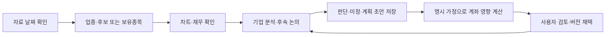

# 투자에이전트 | Investment Agent Engine

한국·미국 주식의 업종 흐름과 종목 후보, 차트, 보유 위험을 확인하는 투자 보조 도구입니다. 반복적인 확인과 계산을 줄이려고 AI와 함께 만들었습니다. 매매는 직접 판단하며 자동 주문은 하지 않습니다.

## 만들면서 해결한 문제

### 1. 어느 업종부터 볼 것인가

- **문제:** 거래 규모가 큰 업종만으로는 새로 관심이 모이는 곳을 찾기 어려웠습니다.
- **선택:** 평소보다 거래가 늘었는지, 증가 속도도 빨라졌는지를 Python으로 계산했습니다.
- **확인:** 저장 자료로 별도 계산해 결과를 대조하고, 하루 급증·일부 종목 쏠림·자료 부족을 구분했습니다.

### 2. 어떤 종목을 지켜볼 것인가

- **문제:** 진입 조건만 찾으면 아직 기다려야 할 종목이 빠졌습니다.
- **선택:** 기존 진입 기준을 유지하면서 ‘관찰 → 돌파 대기 → 진입 조건 충족’으로 나눴습니다.
- **수정:** AI의 차트 검토에서 지속 하락을 횡보로 잡는 오류가 발견됐습니다. 가격 방향과 최근 하락 조건을 보완하고, 같은 오류를 잡는 테스트를 추가했습니다.

### 3. 차트를 어디까지 직접 만들 것인가

- **문제:** 차트와 작도 기능을 하나씩 만들면서 사용성과 개발 부담이 커졌습니다.
- **선택:** TradingView MCP 연결을 검토한 뒤, 차트 표시는 Lightweight Charts를 쓰고 필요한 작도·저장 기능을 추가했습니다.
- **확인:** 선의 수정·삭제·되돌리기, 재시작 후 복원, 종목별 저장을 검사했습니다.

### 4. 매일 편하게 쓰려면 어떻게 연결할 것인가

- **문제:** 계산 결과가 여러 파일에 나뉘어 있어 확인하기 불편했습니다.
- **선택:** 실행 바로가기에서 홈 → 종목·계좌 상세로 이어지는 대시보드를 만들었습니다.
- **확인:** 같은 날 반복 실행하면 결과를 재사용하고, 갱신 실패 시 이전 자료의 날짜를 표시하도록 했습니다.

### 5. 분석한 뒤 무엇을 할 것인가

- **문제:** 기업 보고서를 읽어도 보유 목적·반증·대응 조건과 계좌 영향을 다시 연결해야 했습니다.
- **선택:** 논의와 미정을 기록하고, 특정 계획 버전과 계산 가정을 고정해 Python으로 대응 전후를 비교했습니다.
- **공개:** v2.3.0에는 이 중 순수 계산과 합성 예제를 추가했습니다. 작업대 화면과 개인 기록은 포함하지 않습니다.

## 작업대를 사용하는 순서



계산용 시나리오는 에이전트가 확인된 조건으로 정리하고 중요한 미정만 물어봅니다. 계획 저장·가정 계산·사용자 채택·실제 체결은 서로 다릅니다. [버튼별 사용 안내와 역할 도해](docs/WORKBENCH_WORKFLOW.md)는 비공개 작업대의 전체 흐름을 설명하며, 공개 저장소의 제공 기능 목록과 구분합니다.

## AI와 작업한 방식

저는 필요한 기능과 우선순위, 대안 중 무엇을 선택할지 정했습니다. AI는 대안 조사, 구현, 계산 대조와 테스트를 수행했습니다.

한꺼번에 기능을 늘리기보다 한 묶음씩 보고 이해·수정한 뒤 다음 작업을 정했습니다. 결정 이유와 남은 일은 문서에 남겼습니다.

## 검증에서 확인한 것

- 정상적인 바닥·눌림은 남기고 지속 하락은 제외하는가
- 시장 판단 자료가 없으면 진입 판정을 보류하는가
- 미래 가격을 추가해도 과거 기준선이 바뀌지 않는가
- 계산 중 원본 자료가 바뀌지 않는가

이번 [v2.3.0 검증](docs/VALIDATION_V2_3_0.md)에서 기존 엔진을 포함한 369개 테스트가 통과했습니다. 독립 검수에서 발견한 종목 간 현금의 시간 순서 문제를 수정했고, 새 계획·계좌 예제는 네트워크를 차단한 상태에서도 실행했습니다. 투자 수익률이나 시간 절감 효과는 아직 측정하지 않았습니다.

## 공개 범위

현재 버전은 **v2.3.0**입니다. v2.2.0부터 제공한 업종·종목 선별 계산, 관찰·진입 구분, 보유 위험 계산과 가상 자료 데모를 유지하고, **특정 계획·계좌·환율·체결 가정을 고정한 시나리오 계산**을 추가했습니다. 계산은 Python으로 수행하며 공개 데모는 LLM을 호출하지 않습니다. [새 계산 범위·합성 수치](docs/PORTFOLIO_SCENARIOS.md) · [10월 1일 이후 반영표](docs/PUBLIC_UPDATE_2026_10_05.md).

거래활동 증가·가속 계산과 대시보드·대화형 차트·분석 MCP·개인 기록 저장소는 비공개입니다. 새 공개 작도 코드는 고정 좌표 계산이며 편집 화면이 아닙니다. 기존 공개 공급자 연결은 유지합니다. Lightweight Charts는 차트 표시용이며 TradingView 시세·계정 연결은 포함하지 않습니다. 거래활동 지표는 실제 자금 순유입을 측정한 값은 아닙니다.

## 직접 실행해 보기

<details>
<summary>설치·실행 명령</summary>

Python 3.12 이상이 필요합니다. 저장소 폴더에서 가상환경을 만듭니다.

```sh
python -m venv .venv
```

Windows PowerShell:

```powershell
.venv/Scripts/python.exe -m pip install -e .
.venv/Scripts/python.exe examples/portfolio_scenario_demo.py --output ../synthetic-portfolio-scenario
.venv/Scripts/python.exe examples/watch_review_demo.py --output ../synthetic-watch-review
.venv/Scripts/python.exe examples/market_review_demo.py --output ../synthetic-market-review
.venv/Scripts/python.exe examples/demo.py --instance ../invest-agent-demo
```

macOS / Linux에서는 `.venv/Scripts/python.exe`를 `.venv/bin/python`으로 바꿉니다. 설치에는 다운로드가 필요할 수 있지만, 설치 후 데모에는 네트워크·API 키·실제 계좌가 필요하지 않습니다. 출력은 저장소 밖의 새 폴더에 만듭니다.

시나리오·관찰·시장 데모는 각 출력 폴더의 `report.html`, 계좌 데모는 `reports/`에서 결과를 봅니다. 입력·출력 파일과 제한은 [관찰·진입 데모](docs/WATCH_REVIEW.md), [시장 데모](docs/SYNTHETIC_MARKET_REVIEW.md), [계좌 기능](TRADING.md)을 참고하세요. 실제 입력과 생성 결과는 저장소 밖의 비공개 폴더에 보관합니다.

</details>

<details>
<summary>검사 명령</summary>

아래 `python`에는 설치에 사용한 가상환경 실행파일을 지정합니다.

```sh
python -m unittest discover -s tests -v
python -B scripts/check_git_publication.py --repo .
```

공개 검증은 가상 자료와 모의 공급자를 사용합니다. 실계좌·주문·전체 시장 장기 운영을 검증한 결과는 아닙니다. [검증 범위](docs/VALIDATION_V2_3_0.md) · [공개 파일 검사](PUBLICATION.md)

</details>

## 다음 확인

비공개 작업대의 공식 자료·재무·분석 연결은 구현됐지만 일부 재무 지원과 실제 계좌 입력 검증은 남아 있습니다. 같은 자료를 사용했을 때 분석 오류와 누락, 판단 기록의 재사용이 어떻게 달라지는지 확인하려 합니다. 합성 계산 검증을 투자 성과로 제시하지 않습니다.

[변경 내역](CHANGELOG.md) · [코드 구조](ARCHITECTURE.md)
