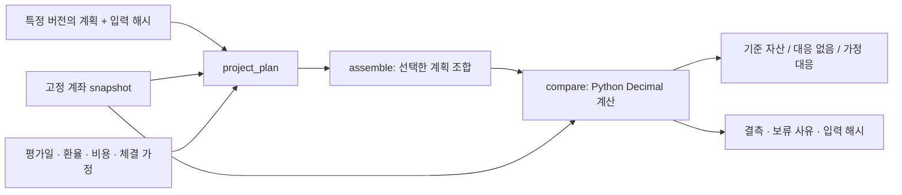

# 계획과 계좌 시나리오 계산

v2.3.0은 이미 저장된 계획·계좌 입력으로 **대응 없음 / 명시한 대응을 가정함**을 비교한다. 현재 시세나 미래 가격을 조회·예측하지 않는다. 입력의 회사·계좌·계획·가격·환율은 데모에서 모두 합성이다.

```sh
python examples/portfolio_scenario_demo.py --output ../synthetic-portfolio-scenario
```

설치한 가상환경의 Python을 사용한다. 저장소 밖의 새 출력 폴더만 허용하며 `report.html`과 입력·가정·결과 JSON을 생성한다. 설치 후 이 데모는 외부 통신·키·계좌·LLM 없이 실행된다. UI·MCP 서버·계획 저장소는 제공하지 않는다.



## 합성 사례를 손으로 대조하기

기준 환율은 1 USD = 1,000 KRW, 가정 평가 환율은 1 USD = 1,100 KRW다. 한국 가상주식 10주×1,000 KRW, ALPHA 10주×100 USD, 현금 10,000 KRW와 100 USD, 비중복이 확인됐다고 가정한 CMA 5,000 KRW로 시작한다.

| 구분 | 계산 | KRW |
|---|---|---:|
| 기준 자산 | 10,000 + 1,000,000 + 10,000 + 100,000 + 5,000 | 1,125,000 |
| 대응 없음 | 한국주식 8,000 + ALPHA 880,000 + KRW 현금 10,000 + USD 현금 110,000 + CMA 5,000 | 1,013,000 |
| 가정 대응 | 한국주식 8,000 + ALPHA 잔여 5주×80 USD×1,100 + KRW 현금 10,000 + USD 현금 545 USD×1,100 + CMA 5,000 | 1,062,500 |

조건은 완료 일봉 종가 90.00 USD 미만, 합성 관측은 89.00 USD, 별도 가정 체결가격도 이 예제에서는 89.00 USD다. 최초 배정 10주의 절반인 5주를 가정 매도해 445.00 USD를 현금에 더한다. 최종 평가가격은 80.00 USD, 비용은 명시적으로 제외한다. 단위 테스트는 관측 89.00 USD와 체결 90.00 USD처럼 서로 다른 경우도 검사한다.

원 계획의 환율·비용 미정은 그대로 남기고 계산 가정을 별도 입력한다. 정성적 성장 논리 훼손은 수치로 판정하지 않는다. 데모는 `hypothetical` 초안이며 채택을 생성하지 않는다. 예제 날짜는 합성 경로로, 거래소 세션 검증이나 투자 권고가 아니다.

## 공개 API

| 모듈 | 역할 |
|---|---|
| `invest_agent.scenarios.portfolio_scenarios.compare(snapshot, scenario)` | 기준 자산, 무대응, 대응 가정별 자산·수량·현금과 결측 계산 |
| `risk_conditions.evaluate(condition, observation)` | 명시 주기·통화·가격 기준·완료 세션·비교 연산으로 조건 평가 |
| `analysis_geometry.geometry(workspace, chart, context)` | 고정 작도의 좌표로 선/채널 수준 계산. 화면이나 작도 편집기 아님 |
| `risk_adapter.project_plan` / `assemble` | `collaboration.v1` 특정 기록을 계산 입력으로 변환·조합 |
| `risk_adapter.account_projection` | 호출자가 이미 읽은 계좌 입력의 값·미확인 상태 정규화 |
| `risk_adapter.read_plan` / `save_review` | 호출자가 주입한 RPC 함수에 명시 요청. 자체 전송·인증·DB 구현 없음 |

예제 입력은 `examples/synthetic_risk_portfolio.json`과 `examples/synthetic_collaboration-v1.json`이다. 두 JSON은 합성 테스트용 계약 예제이며 신뢰할 수 없는 임의 JSON을 위한 완전한 스키마 검증기는 아니다. 호출자는 입력 구조·권한·계좌 귀속·관측시각·자료 출처를 검증해야 한다.

## 해석 경계

- 총액의 `null`은 0이 아니다. 환율·가격·자산 구성·비중복 확인이 빠지면 `known_subtotal`만 남고 전체 `total`은 비어 있다.
- 기준 자산은 미래 가정이 빠져도 계산될 수 있다. 과거 snapshot의 유효기간은 입력 평가시각과 비교하며 오늘 잔고라는 뜻이 아니다.
- 가격 조건의 `<`와 `<=`, 완료 일봉과 장중, 최초와 잔여 수량, 조건 확인가격과 체결가격을 구분한다.
- 같은 보유에 대한 대안은 자동 합산하지 않는다. 버전·수량 중복·가정 현금 부족·과매도·시간 순서 불일치를 보류한다.
- 같은 계좌·통화의 서로 다른 종목도 현금을 공유한다. 처리 순서상 이전 체결보다 과거인 체결은 보류하며 미래 매도대금으로 과거 매수를 충당하지 않는다. 복잡한 동시 주문·결제일·증거금 모델은 제공하지 않는다.
- `hypothetical`은 가정 계산이다. `adopted` 입력의 채택 기록·해시 일치 검사는 사용자 인증이 아니다. 신뢰한 저장소와 호출자 권한 검증이 별도로 필요하다.
- 해시는 우발적 변형을 찾는다. 작성자 신원·승인·진짜 계좌·실제 체결을 증명하는 서명이 아니다.
- 작도 계산은 선형 좌표 모델이다. 미래 빈 축에 휴일 달력을 적용하지 않고 기업행동에 맞춰 기존 앵커를 자동 조정하지 않는다.
- 실제 최대손실·VaR·확률·수익률 예측·알림 전송·주문 체결을 제공하지 않는다. 기존 공급자 연결 모듈의 통신 기능과 이 합성 경로는 별개다.

[전체 사용 흐름](WORKBENCH_WORKFLOW.md) · [이번 공개 범위](PUBLIC_UPDATE_2026_10_05.md)
