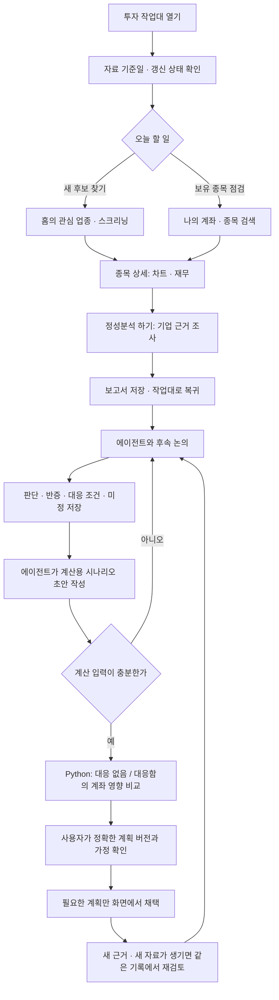

# 투자 작업대 사용 흐름

기준: 2026-10-05. 비공개 로컬 작업대의 사용 흐름을 설명한다. 공개 엔진에는 화면·수집기·MCP 서버·예약 설정이 포함되지 않는다. 공개본에서 실행할 수 있는 범위는 [계산 예제](PORTFOLIO_SCENARIOS.md)에서 확인한다.

작업대는 **볼 종목을 찾고 → 차트와 기업을 검토하고 → 내 판단을 기록하고 → 가정별 계좌 영향을 확인하는 공간**이다. 매일 모든 기능을 순서대로 실행할 필요는 없다. 새 후보를 찾는 날에는 홈에서, 이미 보유한 종목을 검토하는 날에는 검색이나 나의 계좌에서 시작한다.

## 1. 처음에는 날짜와 상태부터 본다

바탕화면 **투자 대시보드** 바로가기로 연다. 화면이 열렸다는 사실과 오늘 자료가 수집됐다는 사실은 다르다. 시장 완료일, 차트 마지막 봉, 재무 공시 기간, 잔고 기준시각을 각각 확인한다.

일반 실행은 KST 하루 첫 실행 때 시장 갱신을 시도하고 같은 날 반복 실행은 저장 결과를 재사용한다. 실패·중단도 자동 반복하지 않는다. 실패 배너의 **오늘의 갱신 재시도**는 추가 시장 시도를 명시적으로 시작하는 버튼이다. 계좌 재조회 버튼으로 이해하면 안 된다.

비공개 운영에서는 매일 06:40 시장 수집·스크리닝 예약을 사용한다. 공개 설치에는 예약을 등록하지 않는다. PC 전원·로그인 세션·허용 네트워크가 필요하며, 등록 사실이 매일 성공을 보장하지 않는다. 예약은 계좌나 LLM 분석을 실행하지 않는다.

## 2. 새 후보와 기존 보유는 출발점이 다르다

| 목적 | 화면에서 할 일 | 확인할 질문 |
|---|---|---|
| 새 후보 발굴 | 홈 관심 업종 → 스크리닝 → 종목 상세 | 거래가 늘어나는 업종인가? 관찰·돌파 대기·진입 조건 중 어디인가? |
| 이미 관심 있는 종목 | 상단 종목명·티커 검색 → 상세 | 최근 변화가 기존 판단을 바꾸는가? |
| 보유종목 점검 | 나의 계좌 → 잔고·보유 비중 → 종목 | 보유 목적과 현재 비중이 맞는가? 무엇이 달라지면 대응할 것인가? |

후보 분류는 검토 순서다. ‘진입 조건 충족’이라는 계산 결과도 자동 매수 지시나 예상 수익률이 아니다. 섹터 맥락이 없으면 결측으로 읽고, 보유종목은 스크리너 밖에 있어도 별도로 검토한다.

## 3. 차트에서 내 관찰을 남긴다

종목 상세에서 일·주·월봉과 기간을 바꾸어 큰 구조와 최근 위치를 확인한다. 작도는 종목별 공통으로 저장되고 이동평균 설정은 주기별이다. 저장 상태와 충돌 안내를 확인한다.

- 추세선·박스·구간 측정: 두 점을 찍는다.
- 평행 채널: **시작 하단점 → 끝 하단점 → 상단점** 순서다.
- 수평선: 한 점을 찍는다.
- 손익비: 진입 → 손절 → 목표 순서다. 가격 거리 계산이며 비용·갭·실제 체결을 반영한 결과가 아니다.
- 선택·이동 또는 작도 목록·정밀 편집으로 수정하고, 미완성 작도는 Esc로 취소한다.

미래 빈 공간에 그린 선은 미래 시세가 아니다. 일·주·월 표시를 바꿔도 실제 앵커 날짜를 유지하지만 기업행동에 맞춘 자동 재조정을 보장하지 않는다. 선을 그린 것과 그 선을 대응 계획의 기준으로 채택한 것은 별도다.

## 4. 재무 숫자를 확인한 뒤 기업 근거를 조사한다

저장된 재무요약에서 연간·분기 기간과 매출·이익·EPS·성장률을 확인한다. 값의 설명에서 산식·출처·기간·결측 이유를 읽는다. 업종별로 적용할 수 없는 지표와 없는 값을 0으로 해석하지 않는다.

일반 지원 경로의 **재무요약 만들기 / 다시 만들기**는 선택 종목만 공식 자료를 수집하고 계산한다. 저장 전용 실행 모드에서는 새 생성이 차단되며, IFRS·공시통화·ADR 등 일부 경로는 미지원이다. 버튼이 보인다는 사실이 모든 기업의 계산 지원을 뜻하지 않는다.

**정성분석 하기**를 누르면 스킬·분석 키·저장 요청이 들어간 새 대화 입력으로 이어진다. 사용자가 입력을 전송해야 분석이 시작된다. 분석은 과거 주가 변화의 사건·촉매, 회사의 사업 근거, 성장 논리와 위험을 조사한다. 분석 결과가 저장됐는지 기록 ID와 복귀 링크를 확인하고 종목 상세 하단 보고서로 돌아온다.

## 5. 보고서를 읽은 다음이 실제 판단 작업이다

에이전트와 같은 종목 기록에서 자연스럽게 논의한다. 새 대화에서도 분석 연결·이어가기 경로를 사용하면 기존 요약·정확한 계획 버전·미정 질문을 먼저 읽게 된다.

다음처럼 말하면 된다.

> “이 종목은 장기 보유가 목적이야. 일봉 종가가 내가 그린 하단 아래에서 끝나면 바로 매도하기보다 기업 근거가 훼손됐는지 다시 보고 싶어. 아직 물량은 정하지 않았어. 이 판단과 미정을 저장해줘.”

필요한 기록은 자료 기준, 기업 근거, 현재 판단과 반증, 보유 목적, 조건별 대응, 계산 가정, 변경 이력이다. 이를 매번 일곱 문항으로 답할 필요는 없다. 이미 말한 내용과 보고서에서 채우고 실제 판단을 바꾸는 미정만 논의한다.

‘회사 발표’, ‘확인 사실’, ‘내 관찰’, ‘분석 가설’을 구별한다. 논의가 덜 끝나도 현재 합의와 미정을 저장할 수 있다. 말한 내용을 저장했다고 계획이 채택되거나 주문되는 것은 아니다.

## 6. 시나리오 입력은 에이전트가 정리한다

> “지금 합의한 조건으로 계산용 시나리오 초안을 만들어줘. 부족한 가정은 중요한 것부터 물어보고, 가능한 범위는 위험 계산해서 같은 종목 기록에 저장해줘.”

에이전트가 사용자 조건과 저장 자료로 평가일·가정 가격·환율·비용·체결 가정 등을 구조화한다. 사용자가 여러 계산 필드를 직접 일괄 작성하는 흐름이 아니다. 기한이나 체결가가 없으면 임의로 넣지 않는다. **조건 발동 가격, 가정 체결가격, 미래 평가가격**은 서로 다른 값이다.

시나리오가 없는 초안에는 계산 선택이 비활성화된다. **에이전트와 계산 준비 이어가기**에서 논의를 계속한다. 초안도 명시적 가정으로 계산할 수 있지만 채택된 계획으로 표시하지 않는다.

## 7. 나의 계좌에서 결과의 의미를 확인한다

계좌 자료가 충분하면 **대응하지 않았을 때 / 계획대로 대응했다고 가정했을 때**의 자산·수량·현금 변화를 비교한다. 실제 계좌 기준시각, 계획 버전, 가정 평가일과 환율·비용을 함께 확인한다. 종목 하나의 가격 거리 손익비와 계좌 전체의 가정 손익은 다르다.

미확인 자산·현금 중복·환율·식별자 등으로 총액이 비어 있으면 계산이 아직 완성되지 않은 것이다. 확인된 일부 합계를 전체 자산이나 매수 가능액으로 읽지 않는다.

계획을 실행 기준으로 사용하려면 화면에서 **해당 버전과 가정**을 검토하고 채택한다. 이후 새 초안을 만들어도 기존 채택 버전은 자동 교체되지 않는다. 실제 체결은 별도이며 작업대가 주문을 전송하지 않는다.

## 하루 사용 예시

1. 홈에서 자료 날짜·실패/부분 상태를 확인한다.
2. 관심 업종이나 보유종목 중 오늘 볼 종목 하나를 고른다.
3. 차트·저장 재무를 읽고 필요할 때만 기업 분석을 요청한다.
4. 판단이 달라졌다면 근거·반증·대응을 논의하고 저장한다.
5. 물량이나 현금에 영향을 주는 판단이면 시나리오 계산을 이어간다.

새 근거가 없으면 기존 기록을 확인하고 끝내도 된다. 재분석·재수집·새 계획 채택을 매일 반복할 필요는 없다.

## 구현과 검증의 구분

실제 운영 계좌는 식별자·가격 관측시각·현금/부채 대조 등 미정으로 위험 총액이 보류될 수 있다. 합성 계산 성공을 실계좌 전체 계산 성공으로 해석하지 않는다. 재무 지원·수집 상태·입력 기준일은 각 화면에서 확인한다.

[이번 공개 코드 범위](PUBLIC_UPDATE_2026_10_05.md) · [계획·계좌 계산 예제](PORTFOLIO_SCENARIOS.md)

## v2.4.0 후속 공개

이 문서의 이전 MCP 제외 범위는 v2.3.0 기준이다. v2.4.0에서는 MCP 도구 16개와 로컬 통신 연결 코드, 합성 예제를 추가 공개한다. 실제 DB·운영 백엔드·대시보드·개인 자료는 포함하지 않는다. [현재 MCP 범위](WORKBENCH_MCP.md)
